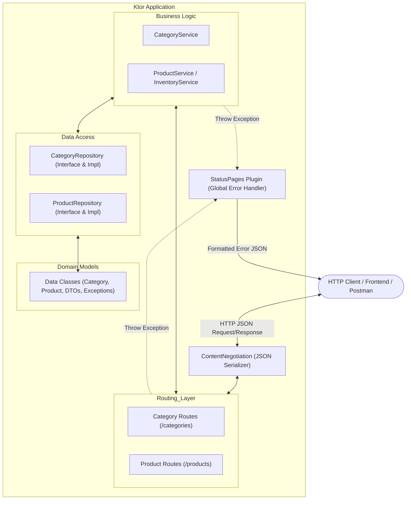

# Implementation Plan & Architectural Guide: Simple E-commerce Inventory API (Ktor)

เอกสารนี้เป็นแผนการออกแบบสถาปัตยกรรมและการพัฒนาโปรเจค **Simple E-commerce Inventory API** ด้วย **Kotlin** และ **Ktor** ตามข้อกำหนดใน [Guide.md](Guide.md) พร้อมคำอธิบายเชิงลึกในแต่ละส่วน เพื่อให้ผู้เรียนเข้าใจทั้ง **"ทำไมถึงต้องออกแบบแบบนี้ (Why)"** และ **"ทำงานอย่างไร (How)"**

---

## 1. Goal Description & Overview

สร้าง RESTful API สำหรับระบบคลังสินค้า (Inventory Management) ของร้านค้าออนไลน์ขนาดเล็ก มี 2 โมเดลหลักคือ **Category** (หมวดหมู่สินค้า) และ **Product** (สินค้า) โดยมีความสัมพันธ์แบบ Many-to-One พร้อม Business Logic การจัดการสต็อกสินค้าที่ปลอดภัย ไม่ให้สต็อกติดลบ และรองรับ Concurrency

### หัวใจสำคัญของระบบ
1. **RESTful Best Practices**: ใช้ HTTP Methods (`GET`, `POST`, `PUT`, `DELETE`) และ Status Codes (`200 OK`, `201 Created`, `204 No Content`, `400 Bad Request`, `404 Not Found`, `409 Conflict`) อย่างถูกต้อง
2. **Layered Architecture (Separation of Concerns)**: แบ่งโค้ดเป็นชั้น Routing -> Service -> Repository -> Model ชัดเจน เพื่อง่ายต่อการทดสอบและขยายผล
3. **Data Integrity & Concurrency**: จัดการปรับปรุงสต็อกแบบ Thread-Safe / Transaction-like ป้องกัน Race Condition
4. **Centralized Exception Handling**: ดักจับ Error และแปลงเป็น JSON Error Response ที่เป็นมาตรฐานเดียวกัน

---

## 2. System Architecture & Design Principles

### 2.1 Layered Architecture (การแบ่ง Layer)



### ทำไมต้องแบ่งเป็น 3 Layer หลัก?
* **Routing Layer (Controller)**: มีหน้าที่รับ HTTP Request, ตรวจสอบพารามิเตอร์เบื้องต้น (เช่น แปลง String เป็น Int ID), เรียกใช้ Service และคืนค่า HTTP Response พร้อม Status Code **(ห้ามเขียน Business Logic ตรงนี้เด็ดขาด)**
* **Service Layer**: หัวใจของ Business Logic เช่น ตรวจสอบว่าสินค้ามีสต็อกพอตัดหรือไม่, ตรวจสอบว่า Category มีอยู่จริงก่อนสร้าง Product หรือไม่ ทำให้สามารถเขียน Unit Test ส่วน Business Rules ได้ 100% โดยไม่ต้องพึ่ง HTTP Engine
* **Repository Layer**: จัดการจัดเก็บและดึงข้อมูล (Data Access) ทำงานร่วมกับ In-memory Data Store (หรือ Database) โดยใช้ Interface เพื่อให้สามารถเปลี่ยนไปใช้ SQL / Exposed / PostgreSQL ได้ในอนาคตโดยไม่ต้องแก้ Service

---

## 3. Data Models & DTO Design

### 3.1 Entity Model (ภายในระบบ)

```kotlin
// หมวดหมู่สินค้า
@Serializable
data class Category(
    val id: Int,
    val name: String
)

// สินค้า (Many-to-One กับ Category)
@Serializable
data class Product(
    val id: Int,
    val name: String,
    val description: String?,
    val price: Double,
    val stockQuantity: Int,
    val categoryId: Int
)
```

### 3.2 Request & Response DTOs (Data Transfer Objects)
> **ทำไมไม่ใช้ Entity รับ Request โดยตรง?**
> เวลา Client ส่ง `POST /products` Client จะยังไม่มี `id` ของสินค้า (เพราะ Server เป็นคน Generate ให้) การแยก DTO (เช่น `CreateProductRequest`) จะช่วยคัดกรองฟิลด์ที่อนุญาตให้ส่งเข้ามา ป้องกันปัญหา Over-posting / Mass Assignment

```kotlin
@Serializable
data class CreateCategoryRequest(
    val name: String
)

@Serializable
data class UpdateCategoryRequest(
    val name: String
)

@Serializable
data class CreateProductRequest(
    val name: String,
    val description: String? = null,
    val price: Double,
    val stockQuantity: Int = 0,
    val categoryId: Int
)

@Serializable
data class UpdateProductRequest(
    val name: String,
    val description: String? = null,
    val price: Double,
    val categoryId: Int
)

@Serializable
data class AdjustStockRequest(
    val amount: Int
)

@Serializable
data class ErrorResponse(
    val status: Int,
    val message: String,
    val timestamp: Long = System.currentTimeMillis()
)
```

---

## 4. API Endpoints Specification

| Method | Endpoint | Description | Success Status | Error Statuses |
| :--- | :--- | :--- | :--- | :--- |
| `GET` | `/categories` | ดึงรายชื่อหมวดหมู่ทั้งหมด | `200 OK` | - |
| `GET` | `/categories/{id}` | ดึงหมวดหมู่ตาม ID | `200 OK` | `404 Not Found`, `400 Bad Request` |
| `POST` | `/categories` | สร้างหมวดหมู่ใหม่ | `201 Created` | `400 Bad Request`, `409 Conflict` |
| `PUT` | `/categories/{id}` | แก้ไขหมวดหมู่ | `200 OK` | `404 Not Found`, `400 Bad Request` |
| `DELETE` | `/categories/{id}` | ลบหมวดหมู่ | `204 No Content` | `404 Not Found`, `409 Conflict (มีสินค้าผูกอยู่)` |
| `GET` | `/products` | ดึงรายการสินค้าทั้งหมด (รองรับ `?categoryId=1`) | `200 OK` | `400 Bad Request` |
| `GET` | `/products/{id}` | ดึงสินค้าตาม ID | `200 OK` | `404 Not Found`, `400 Bad Request` |
| `POST` | `/products` | สร้างสินค้าใหม่ | `201 Created` | `400 Bad Request`, `404 Not Found (Category ไม่มีอยู่)` |
| `PUT` | `/products/{id}` | แก้ไขรายละเอียดสินค้า | `200 OK` | `404 Not Found`, `400 Bad Request` |
| `DELETE` | `/products/{id}` | ลบสินค้า | `204 No Content` | `404 Not Found` |
| `POST` | `/products/{id}/add-stock` | เพิ่มจำนวนสต็อกสินค้า | `200 OK` | `400 Bad Request`, `404 Not Found` |
| `POST` | `/products/{id}/reduce-stock`| ลดจำนวนสต็อกสินค้า (ตัดสต็อก) | `200 OK` | `400 Bad Request (สต็อกไม่พอ/ติดลบ)`, `404 Not Found` |

---

## 5. Business Logic & Exception Handling

### 5.1 Business Rules สำคัญ
1. **Category Validation**:
   - ชื่อหมวดหมู่ต้องไม่ว่างเปล่า (`name.isNotBlank()`)
   - ไม่สามารถลบ Category ที่ยังมี Product ผูกอยู่ได้ (ป้องกัน Referential Integrity เสียหาย)
2. **Product Validation**:
   - `price` ต้อง `>= 0.0`
   - `stockQuantity` เริ่มต้นต้อง `>= 0`
   - `categoryId` ที่ส่งมาต้องมีอยู่จริงในระบบ
3. **Stock Management & Thread Safety**:
   - การเติมสต็อก (`add-stock`): `amount` ต้อง `> 0`
   - การตัดสต็อก (`reduce-stock`): `amount` ต้อง `> 0` และ `currentStock - amount >= 0` ถ้าสต็อกไม่พอต้อง throw `InsufficientStockException`
   - ใช้ Thread-Safe mechanism (เช่น `ConcurrentHashMap` และ Atomic/Synchronized block ใน Repository) เพื่อป้องกัน Concurrency / Race Condition

### 5.2 Custom Domain Exceptions
```kotlin
sealed class DomainException(message: String) : RuntimeException(message)

class NotFoundException(message: String) : DomainException(message)
class ValidationException(message: String) : DomainException(message)
class ConflictException(message: String) : DomainException(message)
class InsufficientStockException(message: String) : DomainException(message)
```

### 5.3 Global Exception Handling with `StatusPages`
ติดตั้ง Plugin `StatusPages` เพื่อดักจับ Exception อัตโนมัติ:
- `NotFoundException` -> `HttpStatusCode.NotFound` (404)
- `ValidationException` / `InsufficientStockException` -> `HttpStatusCode.BadRequest` (400)
- `ConflictException` -> `HttpStatusCode.Conflict` (409)
- `SerializationException` / `BadRequestException` -> `HttpStatusCode.BadRequest` (400)
- `Throwable` ทั่วไป -> `HttpStatusCode.InternalServerError` (500)

---

## 6. Proposed Implementation Changes

### Group 1: Build & Dependencies
#### [MODIFY] `build.gradle.kts`
- เพิ่ม plugin `kotlin("plugin.serialization")`
- เพิ่ม dependencies:
  - `ktorLibs.server.statusPages` (สำหรับจัดการ exception)
  - `ktorLibs.serialization.kotlinx.json` (สำหรับ ContentNegotiation JSON)
  - `kotlinx-serialization-json`
  - `ktorLibs.client.contentNegotiation` (สำหรับ ServerTest JSON client)

---

### Group 2: Models & Exceptions
#### [NEW] `src/main/kotlin/model/Category.kt`
- Data class Category และ DTOs (`CreateCategoryRequest`, `UpdateCategoryRequest`)
#### [NEW] `src/main/kotlin/model/Product.kt`
- Data class Product และ DTOs (`CreateProductRequest`, `UpdateProductRequest`, `AdjustStockRequest`)
#### [NEW] `src/main/kotlin/model/Exceptions.kt`
- Custom Domain Exceptions และ `ErrorResponse` DTO

---

### Group 3: Repository Layer
#### [NEW] `src/main/kotlin/repository/CategoryRepository.kt`
- Interface และ `InMemoryCategoryRepository` จัดการ CRUD หมวดหมู่ด้วย Thread-safe Map และ Auto-increment ID
#### [NEW] `src/main/kotlin/repository/ProductRepository.kt`
- Interface และ `InMemoryProductRepository` จัดการ CRUD สินค้า และเมธอด `updateStock(productId, delta)` พร้อม Data Integrity Check

---

### Group 4: Service Layer (Business Logic)
#### [NEW] `src/main/kotlin/service/CategoryService.kt`
- ตรวจสอบความถูกต้อง, เช็คว่ามีสินค้าค้างอยู่ก่อนลบหรือไม่
#### [NEW] `src/main/kotlin/service/ProductService.kt`
- ตรวจสอบราคา, หมวดหมู่, กฎการเพิ่ม/ลดสต็อก ป้องกันสต็อกติดลบ

---

### Group 5: Routing & Plugins
#### [MODIFY] `src/main/kotlin/Serialization.kt`
- กำหนดค่า `json()` serializer (prettyPrint, ignoreUnknownKeys)
#### [NEW] `src/main/kotlin/StatusPages.kt`
- กำหนดค่า `install(StatusPages)` ดักจับ Domain Exceptions
#### [NEW] `src/main/kotlin/routes/CategoryRoutes.kt`
- REST endpoints สำหรับ `/categories`
#### [NEW] `src/main/kotlin/routes/ProductRoutes.kt`
- REST endpoints สำหรับ `/products` และ `/products/{id}/add-stock`, `/products/{id}/reduce-stock`
#### [MODIFY] `src/main/kotlin/Routing.kt`
- ผูก Dependency Injection (หรือ Instance wiring) และลงทะเบียน route ทั้งหมด
#### [MODIFY] `src/main/resources/application.yaml`
- เพิ่ม module `com.example.StatusPagesKt.configureStatusPages`

---

### Group 6: Unit & Integration Tests
#### [NEW] `src/test/kotlin/service/CategoryServiceTest.kt`
- ทดสอบ Business Logic หมวดหมู่ (การสร้าง, การป้องกันลบเมื่อมีสินค้า)
#### [NEW] `src/test/kotlin/service/ProductServiceTest.kt`
- ทดสอบ Business Logic สินค้า (การสร้าง, ตรวจสอบ Category ID, การตัดสต็อก, การป้องกันสต็อกติดลบ)
#### [NEW] `src/test/kotlin/repository/RepositoryTest.kt`
- ทดสอบการทำงานของ In-memory Repository และ Thread Safety
#### [MODIFY] `src/test/kotlin/ServerTest.kt`
- End-to-End API Integration Tests ด้วย `testApplication` จำลอง HTTP requests ทุก endpoint

---

## 7. Verification Plan

### Automated Tests
1. รัน Unit Tests และ Integration Tests ทั้งหมดผ่าน Gradle:
   ```bash
   ./gradlew test
   ```
2. ตรวจสอบ Test Coverage:
   - `CategoryServiceTest` ผ่านครบทุกกรณี
   - `ProductServiceTest` ผ่านกรณี Boundary condition (สต็อก = 0, สต็อกไม่พอ, เพิ่มสต็อกเป็นลบ)
   - `ServerTest` ทดสอบ HTTP Status codes (200, 201, 204, 400, 404, 409)

### Manual Verification
- รัน Server:
  ```bash
  ./gradlew run
  ```
- ทดสอบ Request จริง เช่น:
  1. `POST /categories` -> `{"name": "Electronics"}` (ได้ `201 Created`)
  2. `POST /products` -> `{"name": "Laptop", "price": 25000.0, "stockQuantity": 10, "categoryId": 1}`
  3. `POST /products/1/reduce-stock` -> `{"amount": 5}` (สต็อกเหลือ 5)
  4. `POST /products/1/reduce-stock` -> `{"amount": 10}` (ได้ `400 Bad Request: Insufficient stock`)
  5. `DELETE /categories/1` (ได้ `409 Conflict: Cannot delete category with active products`)

---

## 8. สรุปความรู้เชิงแนวคิด (Conceptual Takeaways)

1. **Many-to-One Relationship**: สินค้าหลายชิ้นสามารถสังกัดหมวดหมู่เดียวกันได้ โดยเก็บ `categoryId` ใน `Product` และต้องตรวจสอบเสมอว่าหมวดหมู่นั้นมีอยู่จริง
2. **Separation of Concerns**: แยก Layer ชัดเจนเพื่อให้โค้ดดูแลง่าย เทสง่าย และไม่ผูกติดกับเทคโนโลยีฝั่งใดฝั่งหนึ่ง
3. **Data Integrity & Concurrency**: การอัปเดตสต็อกต้องทำในลักษณะ Transaction หรือ Atomic Operation เพื่อป้องกันสต็อกติดลบและ Race Condition เมื่อมีหลาย Request เข้ามาพร้อมกัน
4. **Idempotency & REST Status Codes**: เลือกใช้ Status Code ที่ถูกต้องตามมาตรฐานเพื่อความเข้าใจที่ตรงกันระหว่าง Client และ Server
